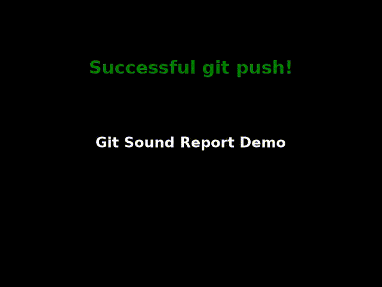

# Git Sound Report

Git Sound Report adds lightweight audio feedback to successful Git work in VS Code. The free core is intentionally fun: when `git add`, `git commit`, `git push`, merge, or checkout succeeds, the extension plays a report-tag style sound.



## What Works

- Command Palette test sound: `Git Sound Report: Play Test Sound`
- Successful terminal Git command detection when VS Code shell integration reports command completion
- Optional repository Git hooks for commit, merge, and checkout events
- VS Code Git API commit detection for source-control UI workflows
- Python-powered intelligent local sound profiles based on commit intent, change size, test files, and risky files
- Optional local voice summaries for commit/deploy outcomes
- Local streak and momentum tracking
- Like/dislike feedback so sound profiles can adapt to the user
- Optional team deploy webhook summaries for deploys and major releases
- Bundled default success sound and Marketplace icon
- Configurable enabled events and custom sound file path
- Status bar control with quick actions
- Opt-in PostHog analytics for activation, toggles, detected Git events, and sponsor clicks
- Sponsor command wired to `https://github.com/sponsors/Steeve-Crypto`

## Setup

1. Install the extension.
2. Run `Git Sound Report: Play Test Sound`.
3. Optional: set `git-sound-report.soundPath` to an absolute `.wav` or `.mp3` path. If unset, the bundled WAV is used.
4. Optional: run `Git Sound Report: Install Git Hooks` for more reliable local commit, merge, and checkout detection.

The extension uses Python for audio playback because it keeps the MVP small and cross-platform. If Python audio packages are unavailable, it falls back to a system notification sound.

## Settings

- `git-sound-report.enabled`: master on/off switch.
- `git-sound-report.enabledEvents`: event allow-list.
- `git-sound-report.soundPath`: custom sound file.
- `git-sound-report.intelligentSound.enabled`: use adaptive bundled sounds instead of one default bundled sound.
- `git-sound-report.pythonPath`: explicit Python executable.
- `git-sound-report.voice.enabled`: speak a short local commit/deploy summary.
- `git-sound-report.teamDeploy.enabled`: enable deploy and major-release webhook summaries.
- `git-sound-report.teamDeploy.webhookUrl`: Slack, Teams, or compatible webhook URL.
- `git-sound-report.telemetry.enabled`: opt-in analytics switch.
- `git-sound-report.postHogProjectApiKey`: PostHog project API key.
- `git-sound-report.postHogHost`: PostHog capture host.
- `git-sound-report.sponsorUrl`: sponsor conversion URL.

Telemetry is disabled by default and is not sent unless both `telemetry.enabled` and `postHogProjectApiKey` are configured.

Default sponsor URL: `https://github.com/sponsors/Steeve-Crypto`

## Intelligent Sound Profiles

The first AI layer is Python-powered, local-first, and rule-based. Git Sound Report inspects Git metadata, not source contents, to choose one of these profiles:

- `tiny_win`
- `bug_fix`
- `feature_ship`
- `risky_change`
- `deploy_win`
- `test_green`
- `major_release`

Signals include commit message keywords, changed file names, file counts, insertion/deletion counts, dependency files, CI files, tests, migrations, auth, billing, database, and security paths. The VS Code JavaScript layer only captures editor events and spawns Python; the intelligence and audio choice live in `play_sound.py`.

Additional AI behaviors:

- Voice summaries: optional local text-to-speech such as "Bug fix committed" or "Deployment pushed."
- Streak and momentum: local state tracks current streak, today's count, and momentum labels.
- Personalized learning: like/dislike commands adjust future profile choices for low-risk sounds.
- Team deploy sound: optional webhook sends deploy and major-release summaries to team tools.

## Product Model

Free tier:

- Core Git success sounds
- Manual test command
- Basic configuration
- Sponsor button

Pro tier:

- Premium sound packs
- AI-assisted adaptive sound profiles
- Voice summaries and personalized sound learning
- Streaks and local stats
- Custom per-event sounds
- Themeable status bar states

Future paid tiers can add premium sound packs, native audio, and managed team features after the public MVP has traction.

## Development

```bash
npm install
npm run lint
npm run package
```

Use VS Code's Extension Development Host to test the extension locally. For Git command detection, terminal shell integration must be enabled in VS Code. Git hooks are available as a reliability layer for local repository events.

Repository: `https://github.com/Steeve-Crypto/Report-Tags`
